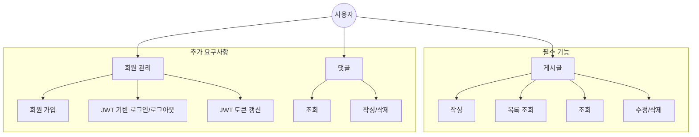
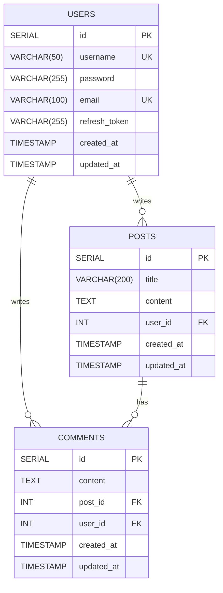

# 항해99 플러스 백엔드 코스 6기 프레임워크 사전 스터디 1주차 - UML 및 ERD 설계

## 소개

항해99 플러스 백엔드 코스 6기 프레임워크 사전 스터디 1주차에서 Java와 Spring Boot를 활용한 게시판 애플리케이션의 설계를 위해 UML(Unified Modeling Language)과 ERD(Entity-Relationship Diagram)를 작성했다.
이 과정은 시스템의 구조를 시각화하고, 주요 기능과 데이터베이스 구조를 명확히 이해하는 데 큰 도움이 되었다.

## 1. UML 다이어그램

UML은 시스템의 설계를 시각화하고 문서화하는 데 사용되는 표준화된 모델링 언어다.
이번 프로젝트에서는 시스템의 기능적 요구사항을 명확히 표현하기 위해 유스케이스 다이어그램을 작성했다.

### 유스케이스 다이어그램

유스케이스 다이어그램은 시스템과 사용자(액터) 간의 상호작용을 시각적으로 표현한다.
게시판 애플리케이션의 주요 유스케이스는 다음과 같이 구성된다.

#### 필수 요구사항

- 게시글 관리: 작성, 목록 조회, 조회, 수정/삭제

#### 추가 요구사항

- 회원 관리:
  - 회원 가입
  - JWT 기반 로그인/로그아웃
  - JWT 토큰 갱신
- 댓글 관리: 조회, 작성/삭제

다음은 Mermaid를 사용하여 작성한 유스케이스 다이어그램이다.

[Mermaid Live Editor에서 UML 다이어그램 보기](https://mermaid.live/edit#pako:eNp1UdlKw0AU_ZXhPinUJW1tah4Eta5QsFgQTHwYm2hFm5SY4FIKdUVsHxQtSK2lfVBQKkRx6TclN__gmAY1ovM0Z-HMvWcKkNFkBQRY2dC2MlmqGySdkFTCzmhPD-63sXaPjbPe3i63aS6v6jSfJW71EE-uiN2xnNPbrjYn2s8VLNftTmnJZ0hf3wgZE7FxjodPAXJcdB7undYNwZbl1ioBLSH-QU6I7D1sVgdw_xGbdV9TVPnXYPh2aVslgrVL-7XN5nerj11HUmSReH1G7JeSc9f2A5Je-OSXZpWwcRTQpsTZhbS3qHVFnFbdfu_gTWfAv7Earg8C_mnP7x433T2L5T1huenrKdGpXHy3k_LsM8Flu-SsX9k_y456prmfIPkTpCAEOUXP0TWZ_WzhU5LAyCo5RQKBXWWqr0sgqUXmo6ahze-oGRAM3VRCoGvmahaEFbqxyZCZl6mhJNYoKzf3xeapuqhpAQxCAbZBiHH9cZ6L8cPRGBeNc-FICHZACA8N9kfDPMfHIkODcY6PFEOw6wVwxQ8lMveH)

### 다이어그램 설명

1. **사용자**: 시스템의 모든 기능을 사용하는 주체다.

2. **게시글 관리 (필수 기능)**

   - 작성: 새로운 게시글을 작성한다.
   - 목록 조회: 작성된 게시글의 목록을 조회한다.
   - 조회: 개별 게시글의 상세 내용을 확인한다.
   - 수정/삭제: 게시글을 수정하거나 삭제한다.

3. **회원 관리 (추가 요구사항)**

   - 회원 가입: 새로운 사용자 계정을 생성한다.
   - JWT 기반 로그인/로그아웃: JWT를 사용하여 사용자 인증을 수행한다.
   - JWT 토큰 갱신: 만료된 토큰을 새로운 토큰으로 갱신한다.

4. **댓글 관리 (추가 요구사항)**
   - 조회: 게시글에 달린 댓글을 확인한다.
   - 작성/삭제: 댓글을 작성하거나 삭제한다.

이 유스케이스 다이어그램을 통해 시스템의 주요 기능과 사용자 역할을 명확히 정의할 수 있었다.
게시글 관리가 필수 기능으로, JWT를 사용한 회원 관리와 댓글 기능이 추가 요구사항으로 구분되어 있어 개발 우선순위를 쉽게 파악할 수 있다.

> [!TIP]
> UML 다이어그램 작성 시 고려사항.
>
> - 시스템의 주요 기능을 논리적인 카테고리로 그룹화하자.
> - 필수 기능과 추가 요구사항을 명확히 구분하여 표시하자.
> - 각 카테고리 내의 세부 기능을 구체적으로 나열하자.
> - 사용자와 시스템 간의 상호작용을 명확히 표현하자.
> - 다이어그램은 간결하면서도 시스템의 전체 구조를 잘 보여줄 수 있게 설계하자.

## 2. ERD (Entity-Relationship Diagram)

ERD는 데이터베이스의 구조를 시각적으로 표현한 것으로, 엔티티 간의 관계를 보여준다.
JWT 인증을 적용한 게시판 애플리케이션을 위한 ERD는 다음과 같다.
이 ERD는 PostgreSQL을 사용한다는 점을 고려하여 설계했다.

[Mermaid Live Editor에서 ERD 보기](https://mermaid.live/edit#pako:eNq1U21rwkAM_itHPk2o0qptXb-VzTHZfMHWMUZBjjbaou3J9Ypz2v--q3W6zQobbPlyJHnykCfJbcFnAYIFyG8jOuc09hIibTR0XIdsS6cwpzvu2Y8kCsjo4RR9ssc39_b4qqmqNSIiscRTzu0-u8RnicBEnKK9gUuyFPlUMt19YnJ7_a7j2v0R8TlSgcGUiqpstgq-ZPPymcj-ftGvLtstukhojGRSJUjXa2RF03TNeHCe1gq9GNNoebma44xjGk4FW2DyZ0Jvhv1-d_CT3Vye_4ql4vv8_3Uvu129zraHo7KIB2seCUw9qAAdBZ7jyvoqXEglCBSIkculBPKe9-PxQIQYowcFJqB8UTDlEkczwZxN4oMleIYKcJbNQ7BmdJlKr9Ry-A8fkBVNXhiLjyDpg7WFV7AMrdExNcO8bhtau6M1WwpswGrqaqPdNDXTaOlqRzNbuQJvewItfwf1L_ka)

### ERD 설명

1. **POSTS 테이블**

   - `id`: SERIAL 타입으로 자동 증가하는 기본 키(PK)다.
   - `title`: VARCHAR(200) 타입으로 게시글 제목을 저장한다.
   - `content`: TEXT 타입으로 긴 게시글 내용을 저장한다.
   - `user_id`: INT 타입으로 USERS 테이블의 id를 참조하는 외래 키(FK)다.
   - `created_at`, `updated_at`: TIMESTAMP 타입으로 게시글 작성 및 수정 시간을 추적한다.

2. **USERS 테이블 (추가 요구사항)**

   - `id`: SERIAL 타입으로 자동 증가하는 기본 키(PK)다.
   - `username`: VARCHAR(50) 타입으로 사용자 이름을 저장하며, UNIQUE 제약조건을 갖는다.
   - `password`: VARCHAR(255) 타입으로 암호화된 비밀번호를 저장한다.
   - `email`: VARCHAR(100) 타입으로 이메일 주소를 저장하며, UNIQUE 제약조건을 갖는다.
   - `refresh_token`: VARCHAR(255) 타입으로 JWT 리프레시 토큰을 저장한다.
   - `created_at`, `updated_at`: TIMESTAMP 타입으로 계정 생성 및 수정 시간을 추적한다.

3. **COMMENTS 테이블 (추가 요구사항)**
   - `id`: SERIAL 타입으로 자동 증가하는 기본 키(PK)다.
   - `content`: TEXT 타입으로 댓글 내용을 저장한다.
   - `post_id`: INT 타입으로 POSTS 테이블의 id를 참조하는 외래 키(FK)다.
   - `user_id`: INT 타입으로 USERS 테이블의 id를 참조하는 외래 키(FK)다.
   - `created_at`, `updated_at`: TIMESTAMP 타입으로 댓글 작성 및 수정 시간을 추적한다.

### JWT 인증 관련 구현

- USERS 테이블에 `refresh_token` 필드를 추가하여 JWT 리프레시 토큰을 저장한다.
- Access Token은 클라이언트 측에서 관리하므로 데이터베이스에 저장하지 않는다.
- 로그인 시 Access Token과 Refresh Token을 발급한다.
- Access Token 만료 시 Refresh Token을 사용하여 새로운 Access Token을 발급받는다.

### 엔티티 간 관계

- 한 명의 사용자(USERS)는 여러 개의 게시글(POSTS)을 작성할 수 있다. (1:N 관계)
- 한 명의 사용자(USERS)는 여러 개의 댓글(COMMENTS)을 작성할 수 있다. (1:N 관계)
- 하나의 게시글(POSTS)에는 여러 개의 댓글(COMMENTS)이 달릴 수 있다. (1:N 관계)

### PostgreSQL 특성 반영

- SERIAL 타입을 사용하여 자동 증가하는 기본 키를 구현했다.
- TEXT 타입을 사용하여 긴 내용의 게시글과 댓글을 효율적으로 저장할 수 있게 했다.
- TIMESTAMP 타입을 사용하여 생성 및 수정 시간을 정확하게 추적할 수 있게 했다.
- VARCHAR 타입의 길이를 적절히 설정하여 저장 공간을 효율적으로 사용하게 했다.

이 ERD를 통해 우리는 PostgreSQL 기반의 데이터베이스 구조와 각 엔티티 간의 관계를 명확히 정의할 수 있었다.
이는 향후 JPA를 사용한 엔티티 클래스 구현과 데이터베이스 설계에 직접적으로 활용될 것이다.

## 결론

항해99 플러스 백엔드 코스 6기 프레임워크 사전 스터디 1주차에서 우리는 게시판 애플리케이션의 설계를 위해 UML과 ERD를 작성했다.
이 과정을 통해 다음과 같은 성과를 얻을 수 있었다.

1. **UML 다이어그램을 통한 시스템 구조 파악**: 유스케이스 다이어그램을 통해 사용자와 시스템 간의 상호작용을 시각화하고, 주요 기능을 명확히 정의했다.

2. **ERD를 통한 데이터 모델 설계**: 주요 엔티티와 그들 간의 관계를 정의하여 PostgreSQL 기반의 데이터베이스 구조를 설계했다.

3. **JWT 인증 방식 적용**: 세션 기반 인증 대신 JWT를 사용하여 더 확장 가능하고 유연한 인증 시스템을 설계했다.

4. **필수 기능과 추가 요구사항 구분**: 게시글 관리와 JWT 기반 회원 관리를 필수 기능으로, 댓글 기능을 추가 요구사항으로 구분하여 개발 우선순위를 설정했다.

5. **시스템 전체 구조에 대한 이해**: UML과 ERD를 통해 애플리케이션의 전체 구조와 데이터 흐름을 종합적으로 이해할 수 있었다.

PostgreSQL을 선택함으로써 다음과 같은 이점을 기대할 수 있다.

1. **강력한 데이터 무결성**: PostgreSQL의 ACID 준수와 트랜잭션 지원으로 데이터의 일관성을 유지할 수 있다.
2. **확장성**: 대용량 데이터 처리와 복잡한 쿼리 최적화에 강점이 있어, 향후 서비스 확장에 유리하다.
3. **풍부한 데이터 타입**: TEXT, JSONB 등 다양한 데이터 타입을 제공하여 유연한 데이터 모델링이 가능하다.

## 향후 계획: Redis 도입

현재 설계에서는 PostgreSQL을 주 데이터베이스로 사용하고 있지만, 추후 시스템의 성능 향상을 위해 Redis를 도입할 계획이다.
Redis 도입 시 다음과 같은 이점을 얻을 수 있을 것으로 예상된다.

1. **캐싱을 통한 성능 향상**: 자주 접근하는 데이터를 Redis에 캐싱하여 데이터베이스 부하를 줄이고 응답 속도를 개선할 수 있다.

2. **세션 관리 최적화**: JWT의 Refresh Token을 Redis에 저장하여 더 빠른 토큰 검증과 관리가 가능해진다.

3. **실시간 기능 구현**: 실시간 알림이나 채팅 기능을 추가할 경우, Redis의 Pub/Sub 기능을 활용할 수 있다.

4. **Rate Limiting**: API 요청 제한을 구현할 때 Redis를 사용하면 효율적인 관리가 가능하다.

Redis 도입 시 ERD의 변경사항

- USERS 테이블에서 `refresh_token` 필드를 제거하고, 이를 Redis에 키-값 형태로 저장할 계획이다.

Redis 도입을 위한 단계별 계획

1. 현재 시스템의 성능 측정 및 병목 지점 파악
2. Redis 도입이 가장 효과적인 영역 선정 (예: 토큰 관리, 캐싱 등)
3. 개발 환경에 Redis 설정 및 테스트
4. 점진적인 기능 이전 및 성능 테스트
5. 프로덕션 환경 적용 및 모니터링

이러한 설계 과정은 실제 개발 단계에서 매우 중요한 기초가 될 것이다.
다음 단계에서는 이 설계를 바탕으로 Spring Boot 프로젝트를 구성하고, JPA를 활용하여 엔티티를 구현할 예정이다.
또한, PostgreSQL과의 연동을 설정하고, 컨트롤러와 서비스 계층을 개발하여 실제로 동작하는 애플리케이션을 만들어나갈 것이다.

UML과 ERD를 활용한 이러한 접근 방식은 향후 더 복잡한 프로젝트에서도 큰 도움이 될 것이다.
또한, PostgreSQL의 선택과 향후 Redis 도입 계획은 견고하고 확장 가능한 백엔드 시스템을 구축하는 데 기여할 것이다.

앞으로의 개발 과정에서 이번 설계를 기반으로 하여, 효율적이고 유지보수가 용이한 애플리케이션을 구현해 나갈 수 있기를 기대한다.
또한, 지속적인 성능 모니터링과 개선을 통해 사용자에게 더 나은 서비스를 제공할 수 있도록 노력할 것이다.
