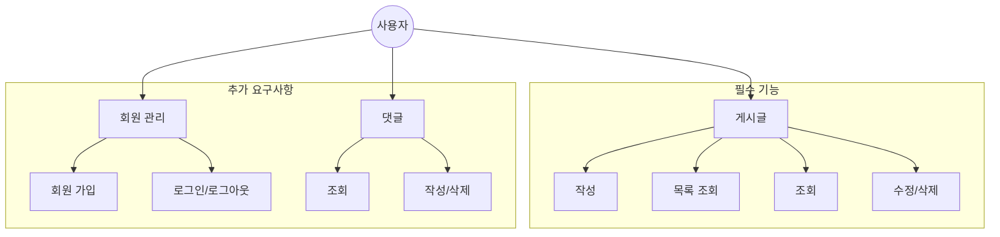

# 항해99 플러스 백엔드 코스 6기 프레임워크 사전 스터디 1주차 - 사전과제 UML 및 ERD

항해99 플러스 백엔드 코스 6기 프레임워크 사전 스터디 1주차에서는 Java와 Spring Boot를 활용한 게시판 애플리케이션의 설계를 위해 UML(Unified Modeling Language)과 ERD(Entity-Relationship Diagram)를 작성했습니다.
이 과정은 시스템의 구조를 시각화하고, 주요 기능과 데이터베이스 구조를 명확히 이해하는 데 큰 도움이 되었습니다.

## 1. UML 다이어그램

UML(Unified Modeling Language)은 시스템의 설계를 시각화하고 문서화하는 데 사용되는 표준화된 모델링 언어입니다.
이번 프로젝트에서는 시스템의 기능적 요구사항을 명확히 표현하기 위해 유스케이스 다이어그램을 작성했습니다.

### 유스케이스 다이어그램

유스케이스 다이어그램은 시스템과 사용자(액터) 간의 상호작용을 시각적으로 표현합니다.
우리의 게시판 애플리케이션의 주요 유스케이스는 다음과 같이 구성됩니다.

#### 필수 요구사항:

- 게시글 관리: 작성, 목록 조회, 조회, 수정/삭제

#### 추가 요구사항:

- 회원 관리: 회원 가입, 로그인/로그아웃
- 댓글 관리: 조회, 작성/삭제

다음은 Mermaid를 사용하여 작성한 유스케이스 다이어그램입니다:

그리고 이 코드로 생성된 다이어그램은 다음과 같습니다:

[유스케이스 다이어그램](https://mermaid.live/edit#pako:eNp1UctKw0AU_ZXhrixEbdra1CwEtb4WBYuunLgYm9iKNikxwUcphKog2kXFFqQv7EJBaaGKj3xTMv0HxyaoEZ3VveecOXPPnSJkNFkBEbb3tINMjugGWk9KKmJndmyMlnu08UA71VDIw_bNraxOCjk0rJ_S8xvk2AP34s7jVrHzXKGXLce2Nn0EjY_PoDlMO1f09CkAzmP38cHtthHtDoaNSoBL4j_ABczeo7f1SVru09uWzymq_Gsw-lZzBhaijZrz2mPzD-t9T5HCzJI2q8h5sdz7nm-QGpkvfnEDi3bOAtwSdrst592mbXvSr1j25okvSmO3cv0dOT26sxxM4IEr_h7-STA7Eq3-bFI_mzRwkFf0PNmR2XcVPykJjJySVyQQWSkTfVcCSS0xHTENbe1IzYBo6KbCga6Z2RyI22Rvn3VmQSaGktwhbGP5L7RA1A1NC_QgFuEQxDg_kRD4uDAdi_OxBB-JcnAEYmQqPBGLCLwQj06FE7wQLXFwPDLgSx9kI-SU)

> [!NOTE]
> 유스케이스 다이어그램에서 '사용자'는 중앙의 주요 액터로 표현되며, 사용자가 수행할 수 있는 주요 기능 카테고리(게시글, 회원 관리, 댓글)가 연결선으로 표시됩니다.
> 각 카테고리 내부에 세부 기능들이 나열되어 있습니다.

### 다이어그램 설명

1. **사용자**: 시스템의 모든 기능을 사용하는 주체입니다.

2. **게시글 관리 (필수 기능)**:

   - 작성: 사용자가 새로운 게시글을 작성합니다.
   - 목록 조회: 작성된 게시글의 목록을 조회합니다.
   - 조회: 개별 게시글의 상세 내용을 확인합니다.
   - 수정/삭제: 작성자가 자신의 게시글을 수정하거나 삭제합니다.

3. **회원 관리 (추가 요구사항)**:

   - 회원 가입: 새로운 사용자 계정을 생성합니다.
   - 로그인/로그아웃: 사용자 인증 및 세션 관리를 수행합니다.

4. **댓글 관리 (추가 요구사항)**:
   - 조회: 게시글에 달린 댓글을 확인합니다.
   - 작성/삭제: 댓글을 작성하거나 삭제합니다.

이 유스케이스 다이어그램을 통해 우리는 시스템의 주요 기능과 사용자 역할을 명확히 정의할 수 있었습니다.
게시글 관리가 필수 기능으로, 회원 관리와 댓글 기능이 추가 요구사항으로 구분되어 있어 개발 우선순위를 쉽게 파악할 수 있습니다.

> [!TIP]
> UML 다이어그램 작성 시 고려사항:
>
> - 시스템의 주요 기능을 논리적인 카테고리로 그룹화하세요.
> - 필수 기능과 추가 요구사항을 명확히 구분하여 표시하세요.
> - 각 카테고리 내의 세부 기능을 구체적으로 나열하세요.
> - 사용자와 시스템 간의 상호작용을 명확히 표현하세요.
> - 다이어그램은 간결하면서도 시스템의 전체 구조를 잘 보여줄 수 있게 설계하세요.

다음 단계에서는 이 UML 다이어그램을 바탕으로 실제 Spring Boot 프로젝트의 구조를 설계하고, 각 기능에 대한 컨트롤러와 서비스 계층을 구현할 예정입니다.
필수 기능인 게시글 관리를 우선적으로 구현한 후, 시간과 리소스가 허용된다면 회원 관리와 댓글 기능도 순차적으로 구현해 나갈 계획입니다.
